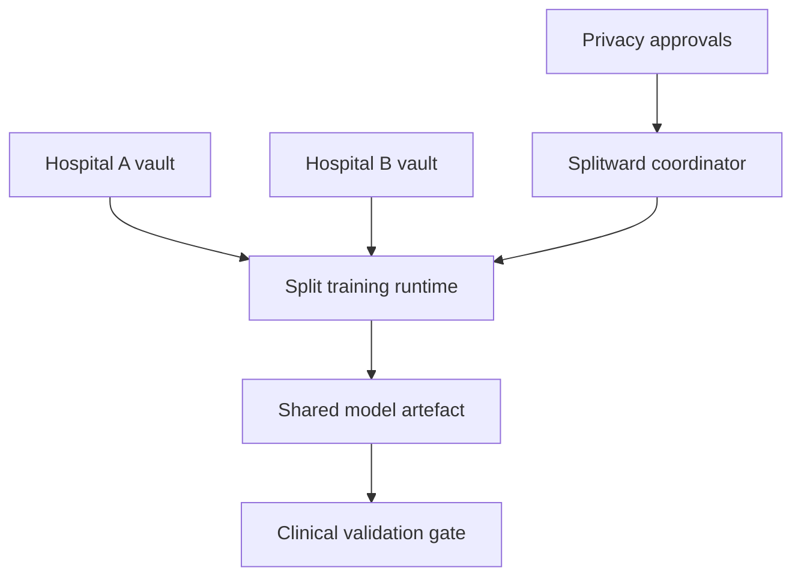

# Splitward

**Source:** `ai-in-decentralized+ai/raskarsplitlearningmit2018-181129165110/`
**Domain:** `ai-decentralized`
**One-liner:** A multi-hospital split-learning control plane that trains shared neural nets across institutions without exchanging raw patient data, so population models improve while each vault keeps custody.
**Wedge:** Hospital groups and national health programmes that want multi-site diagnostic models but cannot pool EHRs under privacy law or institutional policy.
**Positioning:** Raskar’s Camera Culture framing is “share wisdom, not data”: small, invisible health datasets stay local; Split Learning (vs federated-only) splits the net across client and server under low bandwidth/compute; incentives, trust, and regulation sit beside the tech. Splitward is the operational product that schedules split training, measures leakage risk, and governs participation — not a research notebook.

## Market research synthesis

### Thesis from source

The MIT deck positions health AI as stuck between privacy and societal benefit. Valuable signal is “small data” and “invisible” health data trapped in individual vaults and organisations. Pooling is required for population-scale models, but raw patient exchange is unacceptable. Constraints named explicitly: distributed data, patient privacy, incentives, ML expertise, labelling, plus low bandwidth and low compute at the edge. Technical paths compared include anonymise/obfuscate/encrypt, federated learning (train at clients, merge at server), differential privacy, homomorphic encryption, and **Split Learning** (nets split over the network, trained at both sides) per Gupta & Raskar distributed training work. A comparison table contrasts Split vs Federated on memory, compute, bandwidth, and convergence. The broader stack is a Health OS / data market from patient scale to world scale, with Ayushman-style blockchain + AI/SplitNN as a trust and incentive layer. Differentiating product insight: **split the model, not the records**, and run that as a governed multi-party programme with friction, trust, and regulation treated as first-class controls.

### Buyer & economic model

- **Primary buyer:** Hospital CIO / Chief Medical Information Officer or national digital-health programme lead.
- **Users:** clinical ML teams, site IT admins, privacy officers, labelling leads, consortium governors.
- **Budget owner / value metric:** multi-site AI programme budget. Value metric is model lift vs single-site baseline and zero raw-record transfer incidents.
- **Competing status quo:** central data lakes with heavy de-identification; pure federated averaging that exceeds site memory/bandwidth; stalled collaborations that never train.

### Domain constraints

- **Regulatory / trust / safety:** health privacy law, ethics board approvals, cross-border transfer bans, liability for diagnostic outputs.
- **Data sensitivity:** EHR, device, and diagnostic vault data never leave site in raw form; smashed/cut-layer activations still need leakage review.
- **Change-management realities:** sites differ in GPU, labels, and IT maturity; the control plane must tolerate stragglers and partial participation.

## Business requirements

- BR-1: No training job may require upload of raw patient records to the coordinating server.
- BR-2: Sites must be able to join split-training rounds with local compute and bandwidth envelopes declared up front.
- BR-3: Coordinators must choose Split, Federated, or hybrid strategies with an explicit comparison of memory/bandwidth tradeoffs for that study.
- BR-4: Privacy officers must approve study protocols (purpose, retention of activations, participant list) before rounds start.
- BR-5: Labelling workflows must stay local with optional secure aggregation of label stats only.
- BR-6: Model release to clinical use must require human clinical validation sign-off.
- BR-7: Incentive / credit accounting must record each site’s contribution (rounds completed, data volume class) for fairness.
- BR-8: Suspected leakage or protocol violation must halt the round and quarantine artefacts.
- BR-9: Audit packs must prove no raw export occurred for a study period.
- BR-10: Straggler sites must not indefinitely block rounds — policies for timeout and partial aggregation are mandatory.
- BR-11: Patients’ institutional rights requests must be able to exclude a site’s local cohort from future rounds.
- BR-12: Commercial health-data market hooks, if enabled, must still forbid raw exchange and only sell model access or aggregated insights.

## User stories

Canonical user stories live in sibling [USER_STORIES.md](USER_STORIES.md).

## System design

### Overview

Splitward registers sites, datasets (local handles only), and studies. A coordinator defines split topology (client layers vs server layers), runs rounds, aggregates allowed artefacts, and scores contributions. Privacy gates and clinical validation gates bound the lifecycle. Optional incentive ledgers record credits. Raw data planes remain entirely on-site.

### Actors & boundaries

- **Actors:** coordinator, site admin, clinical ML, privacy officer, clinician validator, patient (via institutional rights), operator.
- **Trust boundary:** raw EHR/device data never crosses site boundary; only split activations/gradients per protocol. Coordinator does not hold patient identifiers.
- **Human-in-the-loop points:** protocol approval; production sign-off; incident halt; rights-driven cohort exclusion.

### Core capabilities

1. **Site & dataset registry** — local handles, capacity envelopes.
2. **Study protocol governance** — privacy and ethics approval.
3. **Split/Federated training orchestration** — rounds, topologies, timeouts.
4. **Contribution accounting** — credits and fairness reports.
5. **Leakage / incident halt** — quarantine and alerts.
6. **Clinical validation gate** — production eligibility.
7. **Rights-driven exclusion** — local cohort opt-out.
8. **Audit export** — no-raw-export evidence packs.

### Conceptual data

- **Primary entities:** Site, LocalDatasetRef, Study, ProtocolApproval, TrainingRound, ContributionCredit, Incident, ModelRelease, RightsExclusion.
- **Critical events:** study approved, round started/completed, straggler timed out, incident opened, model signed off, cohort excluded.
- **Retention / audit needs:** protocol, round metadata, and approvals retained for research and regulatory windows; activations retained only per approved TTL.

### Integrations (conceptual)

- **Systems of record:** hospital EHR/PACS, on-prem training runners, ethics board systems, national health ID where lawful.
- **Upstream signals:** device vaults, labelling tools, bandwidth monitors.
- **Downstream actions:** model registries, clinical decision-support staging, consortium billing/credits.

### High-level architecture

### Success metrics

- **Leading:** sites active per round; round success under bandwidth caps; protocol approval cycle time.
- **Lagging:** AUC/lift vs single-site; raw-export incidents (target zero); time-to-production sign-off; site retention in consortium.

## OpenAPI skeleton

Canonical HTTP surface lives in sibling `openapi.yaml`. Summarize here:

- **Base path:** `/v1/...`
- **Auth:** API key and/or Bearer JWT (operator)
- **Resource groups:** Sites, Studies, TrainingRounds, ContributionCredits, Incidents, ModelReleases
