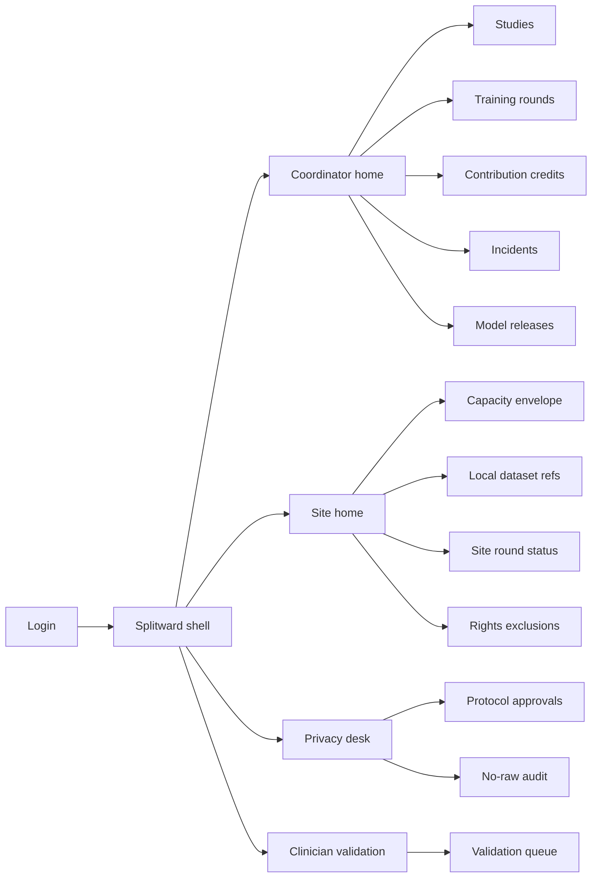
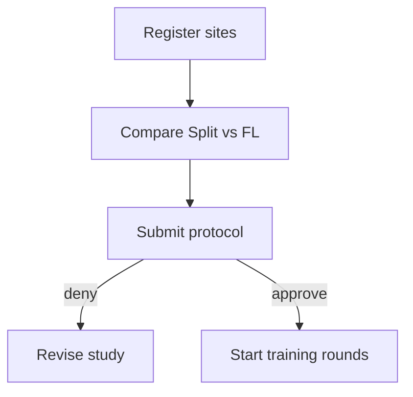
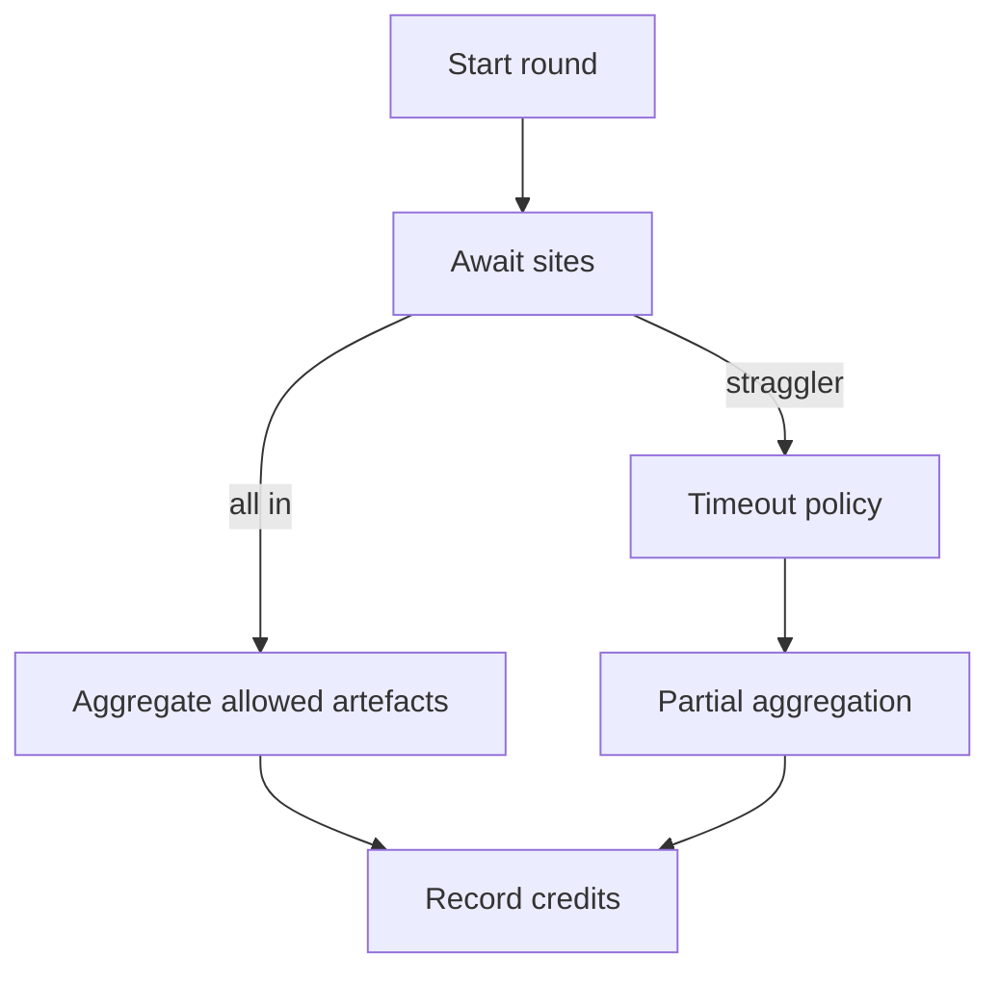

# Splitward — Web app

**Product:** [PRODUCT.md](./PRODUCT.md)
**Primary surface:** Multi-hospital consortium control plane (coordinator + site workspaces under one Splitward shell)
**Secondary surfaces:** Privacy officer protocol desk; clinician validation portal (sign-off only); audit “no raw export” evidence viewer
**Design thesis:** Splitward is a surgical cut across the network — the model splits, the records never leave the vault. The UI metaphor is a sterile cut-layer diagram and round schedule, not a data-lake explorer or a generic FL dashboard. Visual language is clinical teal on cool mist-grey with deep slate chrome: local vaults feel sealed; cut-layer traffic feels thin and supervised; halt states feel unmistakable. The wordmark sits as a ward seal on every study-bearing screen so CIOs and privacy officers know whose “share wisdom, not data” programme they are running.

## UX research synthesis

### Category peers (best-in-class)

- **NVIDIA FLARE / NVFlare console patterns:** Multi-site job orchestration, site status, round progress. Steal: round timeline with per-site health; reject GPU-farm aesthetics that ignore privacy protocol gates.
- **Owkin / federated health collaboration UIs:** Hospital consortium framing, contribution fairness, clinical validation before care use. Steal: contribution credits and clinical sign-off gate; reject opaque “AI drug discovery” marketing as the ops home.
- **Flower / OpenFL operator views:** Strategy comparison and client resource constraints. Steal: Split vs Federated vs hybrid comparison with memory/bandwidth numbers for *this* study; reject notebook-first UX for governors.
- **Epic / hospital privacy request desks (pattern):** Institutional rights workflows that exclude cohorts. Steal: rights-driven local cohort exclusion from future rounds; reject central PHI browsers.

### Patterns to adopt / reject

- **Adopt:** Local dataset handles only (never raw upload); declared compute/bandwidth envelopes; strategy comparison before launch; privacy protocol approval before cut-layer leaves site; straggler timeout policies; leakage halt + quarantine; contribution credit ledger; clinical validation before production; no-raw-export audit packs.
- **Reject:** Central EHR browser; “upload CSV to train”; purple AI diagnostics glow; editable contribution credits; silent promotion of research weights to care pathways; marketplace selling raw cohorts.

### Trust, density, and workflow constraints from PRODUCT.md

No training job may require raw patient upload (BR-1). Sites declare capacity envelopes (BR-2). Coordinators must pick Split/Federated/hybrid with explicit tradeoffs (BR-3). Privacy approves protocols before rounds (BR-4). Labels stay local; only aggregated label stats optionally (BR-5). Clinical sign-off before production (BR-6). Contribution credits for fairness (BR-7). Leakage halts rounds (BR-8). Audit proves no raw export (BR-9). Stragglers cannot block forever (BR-10). Rights exclude local cohorts (BR-11). Any market hook still forbids raw exchange (BR-12).

## Information architecture

### Nav model

### Roles → default home

| Role | Default home | Why |
|------|--------------|-----|
| Clinical ML lead / coordinator | Studies | Launch multi-site split training |
| Site IT admin | Capacity envelope | Cap GPU/egress (BR-2) |
| Privacy officer | Protocol approvals | Gate cut-layer before start (BR-4) |
| Consortium governor | Contribution credits | Fairness visibility (BR-7) |
| Clinician validator | Validation queue | Production sign-off (BR-6) |
| Auditor / regulator liaison | No-raw audit packs | Prove zero raw export (BR-9) |

### Cross-links to OpenAPI resources

| Nav area | OpenAPI tags / resources |
|----------|---------------------------|
| Sites, envelopes, local refs | Sites |
| Study protocols and participants | Studies |
| Round orchestration / timeouts | TrainingRounds |
| Fairness ledger | ContributionCredits |
| Leakage halt queue | Incidents |
| Clinical production eligibility | ModelReleases |

## Screen inventory

### Coordinator home

- **Purpose:** Answer “which studies are training, halted, or awaiting gates — without any raw lake?”
- **Entry:** Coordinator login.
- **Layout regions:** Brand seal; active studies; round success under bandwidth caps; incident rail; awaiting privacy/clinical gates.
- **Primary actions:** New study; open halted round; export programme status.
- **Empty / loading / error:** Empty = register first site + study; error with request id.
- **BR / story ties:** BR-1, BR-8; clinical ML stories.

### Study composer and strategy compare

- **Purpose:** Define split topology and choose Split / Federated / hybrid with memory/bandwidth tradeoffs for this study.
- **Entry:** Studies → create / edit.
- **Layout regions:** Participant list; cut-layer diagram (client vs server layers); strategy comparison table (memory, compute, bandwidth, convergence notes); purpose and activation retention TTL; commercial-market hook toggle (defaults off; still forbids raw).
- **Primary actions:** Save draft; submit for privacy approval; estimate envelopes.
- **Empty / loading / error:** Missing sites = cannot submit; strategy without estimates blocked.
- **BR / story ties:** BR-3, BR-12; ML lead stories.

### Protocol approval (privacy)

- **Purpose:** Approve purpose, activation retention, and participant list before any cut-layer leaves a network.
- **Entry:** Privacy desk default; study submit.
- **Layout regions:** Protocol packet; ethics refs; participant sites; retention TTL; approve/deny with reasons.
- **Primary actions:** Approve; request changes; deny.
- **Empty / loading / error:** Empty queue = healthy; overdue ethics = amber.
- **BR / story ties:** BR-4; privacy officer stories.

### Training rounds console

- **Purpose:** Run rounds under declared envelopes with straggler timeout and partial aggregation policies.
- **Entry:** Study → Rounds; coordinator home.
- **Layout regions:** Round timeline; per-site status (in envelope / straggler / timed out); cut-layer traffic volume (not PHI); timeout policy panel; halt control.
- **Primary actions:** Start round; apply timeout; halt on incident; view partial aggregate policy.
- **Empty / loading / error:** Waiting privacy = blocked banner; site offline = straggler chip.
- **BR / story ties:** BR-2, BR-10; site IT stories.

### Site home — envelope and local refs

- **Purpose:** Cap local GPU/egress and register dataset handles that never upload raw records.
- **Entry:** Site admin login.
- **Layout regions:** Capacity envelope editor; local dataset ref list (handles only); labelling status (local); rights exclusion count.
- **Primary actions:** Update caps; register/unregister handle; open local labelling tool link (external).
- **Empty / loading / error:** No handles = guided register; upload-raw affordance must not exist.
- **BR / story ties:** BR-1, BR-2, BR-5.

### Contribution credits

- **Purpose:** Fairness ledger of rounds completed and data-volume class per site.
- **Entry:** Governor / coordinator Credits.
- **Layout regions:** Append-only credit table; freeloading highlight; export for consortium billing.
- **Primary actions:** Export; dispute credit with incident link (not silent edit).
- **Empty / loading / error:** Empty = no completed rounds yet.
- **BR / story ties:** BR-7.

### Incident halt and quarantine

- **Purpose:** Suspected leakage or protocol violation stops the round and quarantines artefacts.
- **Entry:** Alerts; Incidents nav.
- **Layout regions:** Incident queue; evidence (activation anomaly summary — not PHI); quarantine list; resume criteria.
- **Primary actions:** Halt; quarantine; notify privacy; close with note.
- **Empty / loading / error:** Empty = healthy sealed message.
- **BR / story ties:** BR-8; governor kill-switch story.

### Clinical validation / model release

- **Purpose:** Human clinical sign-off before production eligibility.
- **Entry:** Clinician portal; Releases nav.
- **Layout regions:** Candidate model card (metrics vs single-site baseline); study lineage; validator checklist; sign-off control.
- **Primary actions:** Approve production-eligible; reject to research-only; request more sites/rounds.
- **Empty / loading / error:** Empty = no candidates; unsigned = cannot mark production.
- **BR / story ties:** BR-6; clinician validator stories.

### Rights-driven cohort exclusion

- **Purpose:** Honour institutional patient rights by excluding a site’s local cohort from future rounds.
- **Entry:** Site Rights; privacy.
- **Layout regions:** Exclusion requests; affected studies; confirmation that raw never moved; future-round suppression status.
- **Primary actions:** Apply exclusion; attest local deletion/suppression per site policy.
- **Empty / loading / error:** Empty = no open exclusions.
- **BR / story ties:** BR-11.

### No-raw-export audit pack

- **Purpose:** Prove for a study period that no raw patient export occurred.
- **Entry:** Privacy Audit; coordinator export.
- **Layout regions:** Period picker; job metadata checklist; egress attestations from sites; pack hash; download.
- **Primary actions:** Generate pack; verify hash.
- **Empty / loading / error:** Missing site attestation = incomplete pack warning.
- **BR / story ties:** BR-9.

## Key flows

1. **Launch split study** — register sites → compare strategies → submit protocol → privacy approve → start rounds; failure: denied protocol or envelope exceeded.

2. **Round with straggler** — start → site timeout policy → partial aggregate or wait window → complete credits; failure: indefinite block forbidden (BR-10).

3. **Leakage halt** — anomaly → incident → halt round → quarantine → privacy review (BR-8).

4. **Clinical release** — research weights → validation queue → sign-off → production-eligible (BR-6).

5. **Rights exclusion** — institutional request → exclude local cohort from future rounds → audit note (BR-11).

## Design system

### Tokens (CSS variables)

- `--color-ink: #142028` — primary text on mist
- `--color-mist: #E8EEF0` — panel ground
- `--color-slate-950: #0C1418` — shell chrome
- `--color-slate-800: #1A2830` — elevated chrome
- `--color-ward: #2A8F8C` — clinical teal brand / sealed vault
- `--color-ward-dim: #1A5C5A` — teal on dark
- `--color-halt: #C94C4C` — incident halt
- `--color-amber: #C9953A` — awaiting approval / straggler
- `--color-pass: #3D9A6A` — protocol approved / signed off
- `--color-steel: #5A6A72` — secondary labels
- `--font-display: "Literata", serif` — study titles (clinical gravity, not Inter)
- `--font-body: "IBM Plex Sans", sans-serif`
- `--font-mono: "IBM Plex Mono", monospace` — round ids, cut-layer hashes, credits
- `--space-1`…`--space-8`: 4px scale
- `--radius-sm: 4px`; `--radius-md: 8px`
- `--motion-seal: 180ms ease-out` — vault seal
- `--motion-cut: 220ms ease-in-out` — cut-layer diagram draw
- `--motion-halt: 150ms ease-in` — halt banner
- Atmosphere: soft mist panels, thin teal cut-lines suggesting split topology — sterile programme instrument; no purple AI brain art; no cream-terracotta; no broadsheet.

### Typography & brand

- Literata for study names; Plex for tables; mono for round and artefact ids.
- Splitward wordmark on every study- and audit-bearing view.
- Login: brand + “Share wisdom, not data” + one CTA.

### Do / don’t

- **Do:** Show cut-layer diagrams; seal local vaults visually; require privacy and clinical gates in the lifecycle chrome; show straggler policy on every round.
- **Don’t:** Raw PHI tables; upload-to-train; purple glow; silent production promotion; editable credits; marketplace raw cohort browse.

### Accessibility & domain trust cues

- Halt/approve never colour-only.
- Live regions for halt and protocol decisions.
- Focus order: protocol → rounds → incidents → release.
- Audit packs machine-readable for regulators.

## Component patterns

- **CutLayerDiagram** — client vs server layers for the study topology.
- **StrategyCompareTable** — Split / Federated / hybrid memory-bandwidth tradeoffs.
- **SiteEnvelopeMeter** — GPU/egress caps vs job demand.
- **RoundStragglerChip** — timeout and partial-aggregation state.
- **ProtocolGateBanner** — blocks rounds until privacy approve.
- **ContributionCreditRow** — append-only fairness ledger line.
- **IncidentHaltBanner** — round-stopping leakage state.
- **ClinicalSignOff** — production eligibility control.
- **NoRawExportPack** — period attestation export.

## Out of scope for v1 web

- On-prem training runtime UI beyond status; full PACS/EHR replacement; patient-facing consumer app; cross-border data courier; drug-discovery lab ELN; white-label national portals beyond consortium shell; selling raw health records.
